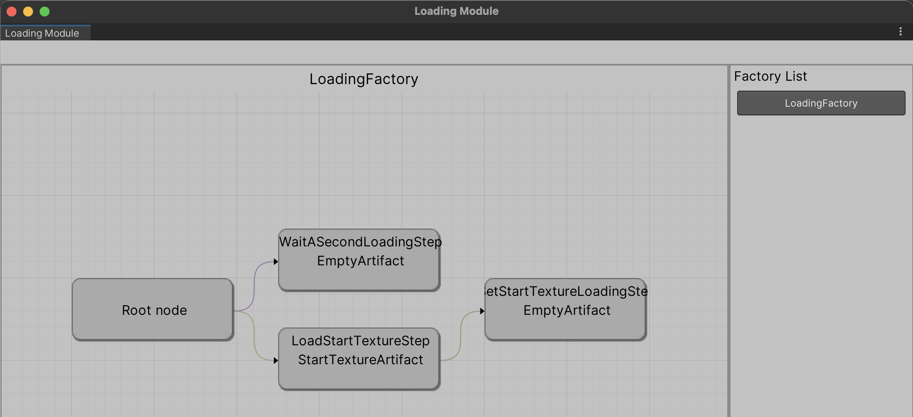

# LoadingModule

### Installation
UPM - `git@github.com:Arikaton/AsyncLoader.git`

### Usage
Loading Steps viewer (use `Tools/Loading Module`)


First you need to create a Loading Step. Loading step can either have a dependencies or provide artifacts
To create a loading step which not provide any artifact just create a class and derive from `EmptyLoadingStep`

```
public class WaitASecondLoadingStep : EmptyLoadingStep
    {
        protected override async UniTask Execute()
        {
            await UniTask.Delay(1000);
        }
    }
```


To provide an artifact, you should create a class, which implements `ILoadingArtifact`, and define all necessary fields.

```
public class SpriteArtifact : ILoadingArtifact
{
    public Sprite Sprite;
}
```


Let's create a step which provide this artifact for us. To do this we should create a new step, and derive from `LoadingStep`, also we should set artifact type in its base constructor

```
public class LoadStartTextureStep : LoadingStep
{
    public LoadStartTextureStep() : base(typeof(SpriteArtifact)) // Define artifact type
    {
    }
    
    protected override async UniTask<ILoadingArtifact> Load()
    {
        var spriteRequest = Resources.LoadAsync<Sprite>("Image");
        var sprite = await spriteRequest;
        return new SpriteArtifact() {
            Sprite = sprite as Sprite
        };
    }
}
```


Then we can create one more loading step, which will use this artifact for its work

```
public class SetSpriteLoadingStep : EmptyLoadingStep
{
    private SpriteArtifact spriteArtifact;
    
    public SetSpriteLoadingStep()
    {
        _dependencies.Add(new Dependency<SpriteArtifact>(artifact => spriteArtifact = artifact));
    }
    
    protected override UniTask Execute()
    {
        var bootstrapper = UnityEngine.Object.FindObjectOfType<Bootstrapper>();
        bootstrapper.resultImage.sprite = spriteArtifact.Sprite;
        return UniTask.CompletedTask;
    }
}
```

Finally, we can create a LoadingFactory for this steps

```
public class LoadingFactory : AbstractLoadingStepFactory 
{
    public override List<LoadingStep> CreateLoadingSteps() {
        return new List<LoadingStep> {
            new WaitASecondLoadingStep(),
            new LoadStartTextureStep(),
            new SetStartTextureLoadingStep()
        };
    }
}
```

In order to start loading, we should use `LoadingInitializer.Init` with necessary fabric. This will return LoadingController with hande methods. Look at example code.

```
public class Bootstrapper : MonoBehaviour
{
    [SerializeField] private Slider progressSlider;
    [SerializeField] private GameObject resultGo;

    public Image resultImage;
    
    private LoadingController loadingController;

    private void Awake()
    {
        progressSlider.value = 0;
        resultGo.SetActive(false);
    }

    private void Start()
    {
        loadingController = LoadingInitializer.Init(new LoadingFactory());
        loadingController.Load();
        
        loadingController.EventSystem.OnLoadingProgress += p => progressSlider.value = p;
        loadingController.EventSystem.OnEndLoading += handler => {
            resultGo.SetActive(handler.IsSuccessful);
        };
        loadingController.EventSystem.OnError += error => {
            Debug.Log(error.Message);
        };
    }
}
```